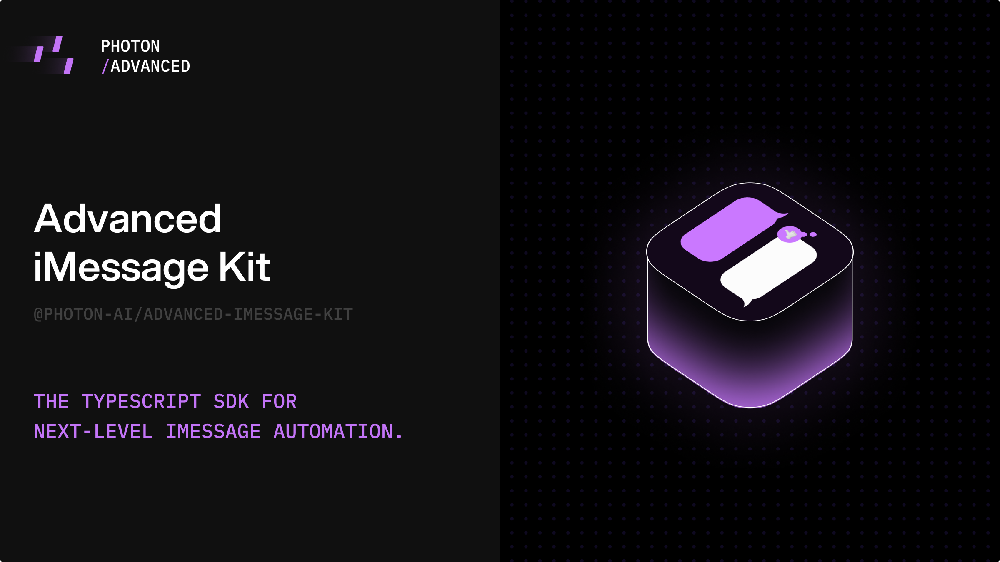

<div align="center">



# Advanced iMessage Kit

> A powerful, type-safe iMessage SDK for macOS with real-time capabilities

</div>

[](https://www.typescriptlang.org/)
[](./LICENSE)

Advanced iMessage Kit provides a comprehensive SDK for **reading**, **sending**, and **automating** iMessage conversations on macOS. Built for developers creating **AI agents**, **automation tools**, and **chat applications** that need deep iMessage integration.

## Features

- **🔒 Type-Safe** - Full TypeScript support with comprehensive type definitions
- **⚡ Real-Time** - WebSocket-based event system for instant message updates
- **📱 Complete API** - Send text, attachments, reactions, edit messages, and more
- **👥 Group Management** - Create groups, manage participants, set icons
- **📎 Rich Attachments** - Send images, files, stickers, and contact cards
- **🔍 Advanced Queries** - Powerful message filtering and search capabilities
- **📊 Analytics** - Message counts, delivery status, and chat statistics
- **🎯 Event-Driven** - Listen to new messages, typing indicators, and status changes

## Quick Start

```typescript
import { AdvancedIMessageKit } from './index'

// Initialize SDK
const sdk = new AdvancedIMessageKit({
    serverUrl: 'http://localhost:1234',
    logLevel: 'info'
})

// Listen for new messages
sdk.on('new-message', (message) => {
    console.log(`${message.handle?.address}: ${message.text}`)
})

// Connect and start listening
await sdk.connect()
```

## Installation

This is a private package. To use it in your project:

```bash
# Clone or download the project
# Then install dependencies
npm install

# Or if using bun
bun install
```

## Prerequisites

Advanced iMessage Kit requires the **Advanced iMessage Kit Server** to be running locally. The server handles the actual iMessage integration and database access.

### Server Setup

1. Download and run the Advanced iMessage Kit Server
2. Grant **Full Disk Access** to your terminal/IDE in System Settings
3. Start the server on `http://localhost:1234` (default)

## Core APIs

### Initialization

```typescript
import { AdvancedIMessageKit, SDK } from './index'

// Method 1: Direct instantiation
const sdk = new AdvancedIMessageKit({
    serverUrl: 'http://localhost:1234',
    logLevel: 'debug'
})

// Method 2: Singleton pattern
const sdk = SDK({
    serverUrl: 'http://localhost:1234'
})
```

### Connection Management

```typescript
// Connect to server
await sdk.connect()

// Listen for connection events
sdk.on('ready', () => {
    console.log('SDK ready')
})

sdk.on('error', (error) => {
    console.error('Connection error:', error)
})

// Disconnect when done
await sdk.disconnect()
```

## Message Operations

### Sending Messages

```typescript
// Send text message
const message = await sdk.messages.sendMessage({
    chatGuid: 'any;-;+1234567890',
    message: 'Hello World!'
})

// Send with options
await sdk.messages.sendMessage({
    chatGuid: 'any;-;+1234567890',
    message: 'Important message',
    subject: 'Subject line',
    effectId: 'com.apple.messages.effect.CKConfettiEffect',
    tempGuid: 'temp-' + Date.now() // Required when using effects or subject
})
```

### Message Queries

```typescript
// Get messages with filters
const messages = await sdk.messages.getMessages({
    chatGuid: 'any;-;+1234567890',
    limit: 50,
    offset: 0
})

// Get message counts
const totalCount = await sdk.messages.getMessageCount({
    chatGuid: 'any;-;+1234567890',
    after: 1640995200000, // timestamp
    before: 1641081600000 // timestamp
})
const sentCount = await sdk.messages.getSentMessageCount()
```

### Message Actions

```typescript
// Edit message
await sdk.messages.editMessage({
    messageGuid: 'message-guid',
    editedMessage: 'Updated text',
    backwardsCompatibilityMessage: 'Updated text'
})

// Add reaction
await sdk.messages.sendReaction({
    chatGuid: 'any;-;+1234567890',
    messageGuid: 'message-guid',
    reaction: 'love', // Valid: love, like, dislike, laugh, emphasize, question, -love, -like, etc.
    partIndex: 0 // Optional: defaults to 0
})

// Unsend message
await sdk.messages.unsendMessage({
    messageGuid: 'message-guid'
})
```

## Chat Management

### Chat Operations

```typescript
// Get all chats
const chats = await sdk.chats.getChats()

// Get specific chat
const chat = await sdk.chats.getChat('chat-guid', {
    with: ['participants', 'lastMessage']
})

// Create new chat
const newChat = await sdk.chats.createChat({
    addresses: ['+1234567890', '+0987654321'],
    message: 'Hello everyone!',
    service: 'iMessage', // 'iMessage' or 'SMS'
    method: 'private-api', // 'apple-script' or 'private-api'
    tempGuid: 'temp-guid-123', // optional
    subject: 'Group Subject', // optional
    effectId: 'com.apple.MobileSMS.expressivesend.impact', // optional
    attributedBody: {} // optional, for rich text
})
```

### Group Management

```typescript
// Update group name
await sdk.chats.updateChat('chat-guid', {
    displayName: 'My Group Chat'
})

// Add participant
await sdk.chats.addParticipant('chat-guid', '+1234567890')

// Remove participant
await sdk.chats.removeParticipant('chat-guid', '+1234567890')

// Leave group
await sdk.chats.leaveChat('chat-guid')
```

### Group Icons

```typescript
// Set group icon
await sdk.chats.setGroupIcon('chat-guid', '/path/to/image.jpg')

// Remove group icon
await sdk.chats.removeGroupIcon('chat-guid')

// Download group icon
const iconBuffer = await sdk.chats.getGroupIcon('chat-guid')
```

### Chat Status

```typescript
// Mark as read
await sdk.chats.markChatRead('chat-guid')

// Mark as unread
await sdk.chats.markChatUnread('chat-guid')

// Typing indicators
await sdk.chats.startTyping('chat-guid')
await sdk.chats.stopTyping('chat-guid')
```

## Attachments & Media

### Attachment Operations

```typescript
// Send attachment
await sdk.attachments.sendAttachment({
    chatGuid: 'chat-guid',
    filePath: '/path/to/file.jpg',
    fileName: 'image.jpg' // Optional: display name
})
```
// Send sticker
await sdk.attachments.sendSticker({
    chatGuid: 'chat-guid', 
    filePath: '/path/to/sticker.png',
    fileName: 'sticker.png', // optional
    selectedMessageGuid: 'message-guid' // optional, for replying to a message
})

// Get attachment info
const attachment = await sdk.attachments.getAttachment('attachment-guid')

// Download attachment
const buffer = await sdk.attachments.downloadAttachment('attachment-guid', {
    original: true,
    quality: 100
})

// Get attachment count
const count = await sdk.attachments.getAttachmentCount()
```

## Contacts & Handles

### Contact Management

```typescript
// Get all contacts
const contacts = await sdk.contacts.getContacts()

// Get contact card by address
const contactCard = await sdk.contacts.getContactCard('+1234567890')

// Share contact card in chat
await sdk.contacts.shareContactCard('chat-guid')

// Check if should share contact
const shouldShare = await sdk.contacts.shouldShareContact('chat-guid')
```

### Handle Operations

```typescript
// Get handle count
const count = await sdk.handles.getHandleCount()

// Query handles
const handles = await sdk.handles.queryHandles({
    address: '+1234567890'
})

// Get specific handle
const handle = await sdk.handles.getHandle('handle-id')

// Check handle availability
const availability = await sdk.handles.getHandleAvailability('handle-id', 'imessage')

// Get handle focus status
const focusStatus = await sdk.handles.getHandleFocusStatus('handle-id')
```

## Real-Time Events

### Message Events

```typescript
// New message received
sdk.on('new-message', (message) => {
    console.log('New message:', message.text)
})

// Message updated (delivery/read status)
sdk.on('updated-message', (message) => {
    if (message.dateRead) {
        console.log('Message read')
    } else if (message.dateDelivered) {
        console.log('Message delivered')
    }
})

// Message send error
sdk.on('message-send-error', (error) => {
    console.error('Send failed:', error)
})
```

### Chat Events

```typescript
// Chat read status changed
sdk.on('chat-read-status-changed', (data) => {
    console.log('Chat read status:', data)
})

// Group events
sdk.on('group-name-change', (message) => {
    console.log('Group renamed:', message.groupTitle)
})

sdk.on('participant-added', (message) => {
    console.log('Participant added:', message.otherHandle)
})

sdk.on('participant-removed', (message) => {
    console.log('Participant removed:', message.otherHandle)
})

sdk.on('participant-left', (message) => {
    console.log('Participant left:', message.otherHandle)
})

sdk.on('group-icon-changed', (data) => {
    console.log('Group icon changed:', data)
})

sdk.on('group-icon-removed', (data) => {
    console.log('Group icon removed:', data)
})

// Typing indicators
sdk.on('typing-indicator', (data) => {
    console.log('Typing:', data.isTyping)
})
```

### System Events

```typescript
// FaceTime call status changes
sdk.on('ft-call-status-changed', (data) => {
    console.log('FaceTime status:', data.status, 'for', data.handle)
})

// Find My location updates
sdk.on('new-findmy-location', (data) => {
    console.log('New location for:', data.handle, 'at', data.coordinates)
})

// New server connection
sdk.on('new-server', (data) => {
    console.log('New server connected:', data)
})
```

## Advanced Features

### FaceTime Integration

```typescript
// Create FaceTime link
const link = await sdk.facetime.createFaceTimeLink()
console.log('FaceTime link:', link)
```

### iCloud Integration

```typescript
// Get Find My friends
const friends = await sdk.icloud.getFindMyFriends()

// Get Find My devices
const devices = await sdk.icloud.getFindMyDevices()

// Refresh Find My data
await sdk.icloud.refreshFindMyFriends()
await sdk.icloud.refreshFindMyDevices()
```

### Scheduled Messages

```typescript
// Schedule a message
await sdk.scheduledMessages.createScheduledMessage({
    chatGuid: 'any;-;+1234567890',
    message: 'Scheduled message',
    scheduledFor: new Date(Date.now() + 3600000), // Date object
    schedule: {
        type: 'once' // or 'recurring'
    }
})

// Get scheduled messages
const scheduled = await sdk.scheduledMessages.getScheduledMessages()

// Update scheduled message
await sdk.scheduledMessages.updateScheduledMessage('message-id', {
    chatGuid: 'any;-;+1234567890',
    message: 'Updated message',
    scheduledFor: new Date(Date.now() + 7200000), // Date object
    schedule: { type: 'once' }
})

// Delete scheduled message
await sdk.scheduledMessages.deleteScheduledMessage('message-id')
```

### Server Management

```typescript
// Get server information
const serverInfo = await sdk.server.getServerInfo()

// Get message statistics
const messageStats = await sdk.server.getMessageStats()

// Get server logs
const logs = await sdk.server.getServerLogs(100)

// Get alerts
const alerts = await sdk.server.getAlerts()

// Mark alerts as read
await sdk.server.markAlertAsRead(['alert-id-1', 'alert-id-2'])

// Get media statistics
const mediaStats = await sdk.server.getMediaStatistics({
    only: ['images', 'videos']
})

// Get media statistics by chat
const chatMediaStats = await sdk.server.getMediaStatisticsByChat('chat-guid-here')
```

## Error Handling

```typescript
try {
    await sdk.messages.sendMessage({
        chatGuid: 'invalid-guid',
        message: 'Test'
    })
} catch (error) {
    if (error.response?.status === 404) {
        console.error('Chat not found')
    } else {
        console.error('Send failed:', error.message)
    }
}
```

## Configuration

```typescript
interface ClientConfig {
    serverUrl?: string      // Default: 'http://localhost:1234'
    logLevel?: 'debug' | 'info' | 'warn' | 'error'  // Default: 'info'
}
```

## Best Practices

### Resource Management

```typescript
// Always disconnect when done
process.on('SIGINT', async () => {
    await sdk.disconnect()
    process.exit(0)
})
```

### Event Handling

```typescript
// Use specific event handlers
sdk.on('new-message', handleNewMessage)
sdk.on('error', handleError)

// Remove listeners when needed
sdk.off('new-message', handleNewMessage)
```

### Performance

```typescript
// Use pagination for large queries
const messages = await sdk.messages.getMessages({
    chatGuid: 'any;-;+1234567890',
    limit: 100,
    offset: 0
})
```

## Examples

Check the `/examples` directory for complete working examples:

- `demo-basic.ts` - Basic SDK usage and event listening
- `demo-advanced.ts` - Advanced SDK features
- `message-send.ts` - Sending messages
- `message-attachment.ts` - Sending files and images
- `message-contact-card.ts` - Sending contact cards
- `message-sticker.ts` - Sending stickers
- `message-edit.ts` - Editing messages
- `message-unsend.ts` - Unsending messages
- `message-reaction.ts` - Adding reactions
- `message-typing.ts` - Typing indicators
- `message-scheduled.ts` - Scheduled messages
- `message-search.ts` - Searching messages
- `message-stats.ts` - Message statistics
- `chat-group.ts` - Group chat management
- `chat-fetch.ts` - Fetching chat data
- `contact-list.ts` - Contact management
- `facetime-link.ts` - FaceTime integration
- `findmy-friends.ts` - Find My integration

## License

MIT License